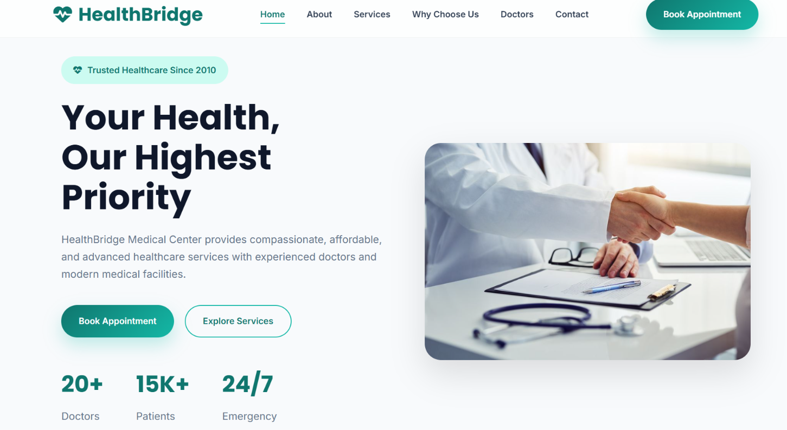
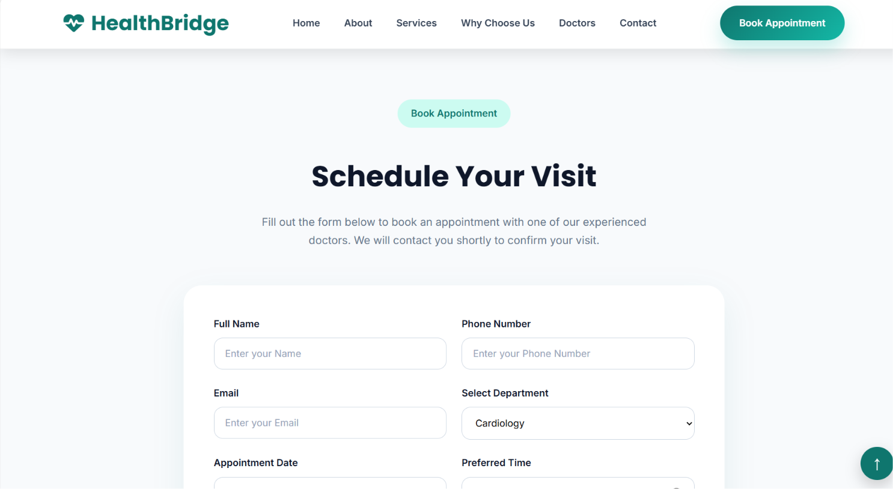
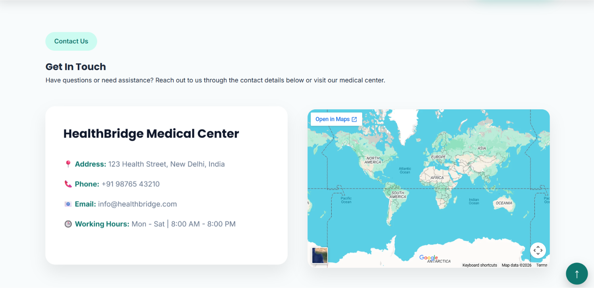
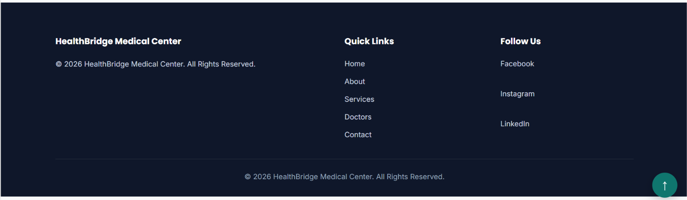

# 🏥 HealthBridge – Healthcare Landing Page

A modern, responsive healthcare landing page built using **HTML5**, **CSS3**, and **JavaScript**. This project focuses on creating a clean, user-friendly interface for a medical clinic, allowing users to explore services, learn about doctors, and book appointments.

---

## 📸 Preview





---

## 🚀 Features

- ✅ Responsive Navigation Bar
- ✅ Hero Section with Call-to-Action Buttons
- ✅ About the Clinic
- ✅ Medical Services Section
- ✅ Why Choose Us Section
- ✅ Doctor Highlights
- ✅ Patient Testimonials
- ✅ Appointment Enquiry Form
- ✅ Client-side Form Validation
- ✅ Contact Information
- ✅ Embedded Google Maps
- ✅ Responsive Footer
- ✅ Smooth Scrolling
- ✅ Mobile Navigation Menu
- ✅ Interactive UI

---

## 🛠️ Technologies Used

- HTML5
- CSS3
- JavaScript (ES6)
- Google Fonts
- Font Awesome Icons
- Google Maps Embed

---

## 📂 Project Structure

```
HealthBridge/
│
├── index.html
├── style.css
├── script.js
├── README.md
└── image.png
└── image-1.png
└── image-2.png
└── image-3.png

```

---

## 📱 Responsive Design

The website is fully responsive and optimized for:

- 💻 Desktop
- 📱 Mobile
- 📟 Tablet

---

## ✨ Website Sections

### 🏠 Home
- Hero Banner
- Call-to-Action Buttons
- Healthcare Statistics

### ℹ️ About
- Clinic Introduction
- Feature Cards
- Experienced Healthcare Team

### 🩺 Services
- Cardiology
- Neurology
- Pediatrics
- Orthopedics
- Orthodontics
- Emergency Care

### ⭐ Why Choose Us
- Experienced Doctors
- Modern Medical Facilities
- Patient-Centered Care
- 24/7 Emergency Support

### 👨‍⚕️ Doctors
- Doctor Profiles
- Experience Details
- Appointment Button

### 📅 Appointment
- Appointment Booking Form
- Form Validation
- Success Confirmation

### 💬 Testimonials
- Patient Reviews
- Interactive Cards

### 📍 Contact
- Clinic Details
- Google Maps
- Working Hours

### 📄 Footer
- Quick Links
- Social Links
- Copyright

---

## ⚙️ JavaScript Features

- Form Validation
- Mobile Navigation Toggle
- Active Navigation Highlight
- Sticky Navigation Bar
- Smooth Scrolling
- Interactive UI Components

---

## 🎯 Learning Outcomes

Through this project, I learned:

- Building responsive layouts using HTML and CSS
- Designing modern user interfaces
- Writing clean and reusable CSS
- Implementing client-side form validation
- Creating interactive web pages with JavaScript
- Using Flexbox and CSS Grid effectively
- Developing mobile-friendly websites

---

## 🚀 Future Improvements

- Backend Integration
- Database Connectivity
- Online Appointment Storage
- User Authentication
- Doctor Dashboard
- Admin Panel
- Live Chat Support
- Dark Mode
- Email Notifications

---

## ▶️ How to Run the Project

🚀 **Live Website:**  
https://intern-sakshi-inbt-021483-i-neu-bytes-657c-8d5ktykpx.vercel.app

> The project is deployed using Vercel.


---

## 📌 Project Status

✅ Task 1 Completed

---

## 👩‍💻 Author

**Sakshi Mishra**

B.Tech Computer Science Engineering

---

## 📄 License

This project is developed for learning and academic purposes.